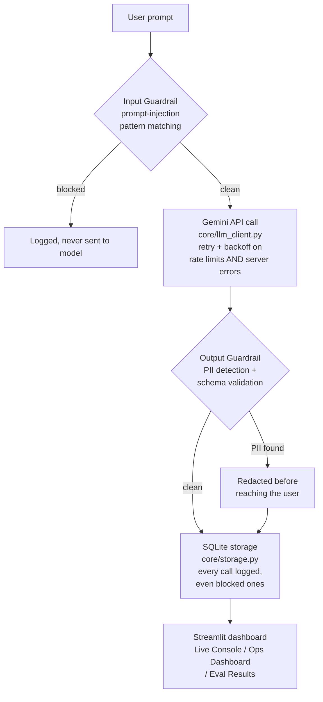

# LLM Ops & Guardrails Platform

**Live demo:** https://ht4waxpgal26yutguytrfr.streamlit.app

A monitoring and safety layer that sits around any LLM call — the part
of an AI system most student projects skip. This project doesn't build
a new AI feature; it builds the **operations layer** that makes an
existing AI feature trustworthy enough to actually run in production:
input guardrails, output PII redaction, cost/latency telemetry, and a
self-testing evaluation suite.

It's designed as a companion to a separate project (an autonomous
multi-agent RAG system) — that project is the "product feature", this
one is the "ops team" that would watch over it once it's live.

**Companion project:** [Autonomous Multi-Agent Enterprise Insight System](https://github.com/RajolKumar2003/multi-agent-insight-system)
([live demo](https://multi-agent-insight-system-cc9lmzbytnwanog4kt4rxi.streamlit.app))

## Why this exists

Most LLM demos stop at "it answers questions." This project answers a
different question: **how do you know the system is behaving safely and
consistently over time, without watching every response by hand?**

That's the job of:
- **Input guardrails** — catching prompt-injection attempts before they
  ever reach the model
- **Output guardrails** — catching and redacting PII the model might
  echo back, before a user ever sees it
- **Telemetry** — logging cost, latency, and token usage on every call
- **A self-testing eval suite** — a red-team prompt set, a PII test set,
  and a quality-regression set, run on demand, with results tracked over
  time rather than checked once and forgotten

## Architecture




## Project structure

- `core/llm_client.py` — the only file that talks to Gemini directly
- `core/guardrails.py` — input injection detection + output PII redaction
- `core/storage.py` — SQLite logging and aggregation
- `eval/red_team_prompts.json` — 15 prompts testing injection detection (offline)
- `eval/pii_test_cases.json` — 8 cases testing PII detection (offline)
- `eval/quality_prompts.json` — 5 prompts testing answer correctness (calls the API)
- `eval/run_eval.py` — runs all three suites, prints + stores results
- `data/` — SQLite database lives here (gitignored)
- `app.py` — Streamlit dashboard (3 tabs)
- `requirements.txt`, `.env.example`, `README.md`


## Why the eval suite is split into "free" and "costs quota" parts

The red-team and PII suites are pure regex — they test `core/guardrails.py`
directly with no API call at all. That means they're free, instant, and
you can run them as often as you like without touching your Gemini quota.
The quality-regression suite is the only one that calls the live API, and
it's deliberately kept to 5 questions to respect the free tier.

This split mirrors how real guardrail systems are actually evaluated:
cheap deterministic checks get tested constantly; expensive model-quality
checks get tested on a budget.

## Setup

```bash
git clone https://github.com/RajolKumar2003/-llm-ops-guardrails-platform.git
cd -llm-ops-guardrails-platform

python -m venv venv
source venv/bin/activate        # Windows: venv\Scripts\activate

pip install -r requirements.txt

cp .env.example .env            # then paste your Gemini API key into .env
```

Get a free Gemini API key at **aistudio.google.com/apikey** — no card
required.

## Running it

**Dashboard (recommended for demoing this live):**
```bash
streamlit run app.py
```

**Run the evaluation suites (produces the numbers below):**
```bash
python -m eval.run_eval
```
This prints red-team, PII, and quality accuracy to the terminal and
stores every result in SQLite, which the dashboard's "Eval Results" tab
then reads back.

The Eval Results tab in the dashboard also has two buttons that run
these exact same suites against the *live, deployed* instance's own
database — so anyone visiting the demo can trigger and see the
self-testing for themselves, not just take this README's numbers on
faith. The guardrail suites (red-team + PII) run instantly for free;
the quality suite button makes 5 real API calls.

## Verified results

The two offline suites below were run directly against this repo's code
with no API dependency, so these numbers are exact, not estimates:

| Suite | Result | Notes |
|---|---|---|
| Red-team / injection detection | **100% (15/15)** | Pure regex, no API call — runs free and instantly |
| PII detection | **100% (8/8)** | Pure regex, no API call — runs free and instantly |
| Quality regression | **100% (9/9 across two runs)** | Calls the live Gemini API — includes automatic recovery from a transient upstream server error, verified live on the deployed instance |

## The "bring your own key" design choice

The live demo runs on a shared, free-tier Gemini key. On a public link,
that quota is easy to exhaust between a handful of visitors. The
dashboard lets any visitor paste in their own free Gemini key instead —
their usage then never touches the shared quota, so many people can use
the demo independently at the same time. This is the same reason real
multi-tenant products never let every customer draw from one shared API
key. The shared demo key is also capped per browser session as a second
layer of protection.

## Resilience to upstream failures

Two distinct failure modes are handled, not just the happy path:

- **Rate limits (429)** — the free tier allows only a handful of
  requests per minute; `core/llm_client.py` retries with exponential
  backoff rather than failing the whole request.
- **Transient server errors (5xx)** — Google's own infrastructure
  occasionally has a brief hiccup unrelated to anything the client did;
  these are retried with a shorter backoff, separately from rate limits.
- **Per-question isolation in the eval suite** — if a single question in
  the quality-regression suite hits an error even after retries are
  exhausted, that one question is logged as a failure and the suite
  continues, rather than the whole run (and the other passing results)
  being lost. This was caught and fixed after a live `ServerError`
  crashed an early version of the deployed demo.

## Tech stack

Python · Google Gemini API (`gemini-3.5-flash-lite`) · SQLite · Streamlit
· regex-based guardrails (no extra ML dependency needed at this scale)

Deliberately does **not** use FAISS or LangGraph — this project isn't a
RAG or multi-agent system, so those libraries would add dependency
weight without doing any real work here.

## Future extensions

- Swap the substring-match quality check for a real LLM-as-judge
  (a second model call scoring the first's answer for correctness/tone)
- Add scheduled drift monitoring (re-run the quality suite on a timer,
  alert if accuracy drops below a threshold)
- Swap SQLite for Postgres/BigQuery if this needed to scale beyond a
  single-file database
- Add OpenTelemetry-style structured tracing instead of the current
  flat SQLite log table